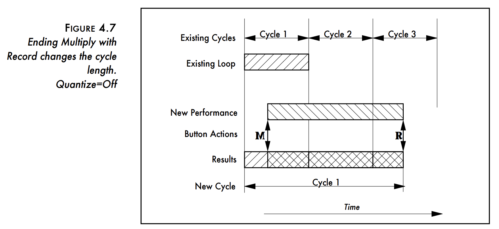

# 2024/8/10

thinking about loopers again. i'd like to try one with a "multiply" feature. this is an exercise, so  approach it minimally, focusing on supporting only the feature under investigation. (at first.) 

the "multiply" operation on a loop is perhaps most familiar / defining as appears in the oberheim/gibson "echoplex digital pro." various flavors of the feature have appeared in loop pedals, but AFAIK the "unquantized multiply" version in particular is not common:

^ here is one of the echoplex modes of interest. (clearly, synchronized multiply is also commonly wanted.)initially, the design here departs from the echoplex version in that i'm going to try and have the new "cycle" begin at the moment of tapping the MUL switch, rather than at the start of the previously defined cycle. i'm thinking of the system as a stack of "loop layers," each of which resets the cycle of the previous layer when its own cycle finishes. but this behavior can be adjusted / extended later.

began conceptualizing this in supercollider, added `mlp.scd` with stubs. but now i'm not sure SC seems right: things like data transfer between .ar/.kr/logic parts of code, are clunky and imprecise. leaning towards either a graph-based prototype, or straight to c++ via iplug.

(_softcut_ is also fairly well suited for this sort of thing, but the ability to synchronize voices precisely is not quite up to the requirements. someday i would like to improve on it or build up a new system with all its features; maybe this could be a start...)

this application is also a good candidate for a daisy/petal port: it's simple, low CPU requirements, and i think a 4-switch interface is about right. so... i'll go straight for the c++ implementation.

end of day: pushed first draft of untested c++ implem. (initially had all the low-jitter boilerplate in there, but too complicated/unnecessary for POC.)

**time:** ~2hrs

# 2024/8/11

first run of the first-draft program, fixed issues with basic audio setup.

ready to test actual processing, i stepped in a rabbit hole: 
- liblo suddenly seems to not work on my machine, at least during debug (macbook air m1. oddly i don't seem to have used liblo before in any projects on it?) the symptom is frustrating - messages just disappear. 
- i don't want to debug this, so maybe it's time to investigate other options, like `oscpack`
- with `oscpack` i can receive messages (yay.) but, it triggers an assertion because numerical type definitions are wrong for this architecture (boo)
- so i have quickly forked `oscpack` and hacked in a fix. now i must waste a little more time learning its API and porting the POC...

... finished the port, OSC reception seems ok. crashing somewhere in audio stack...

**NTS**: design-wise, i would love to be able to dynamically re-define things like layer-sync behavior, tap logic etc to be definable in lua or some other scripting language. but, it's a special challenge to have user-defined script executed on realtime audio thread, and i've yet to build a system that does this well. (have looked at e.g. cockos EEL2, and the possibility of lua with granular control of GC, but the fact is that i don't really enjoy software enough to want to solve those problems.)

**time**: ~2hrs